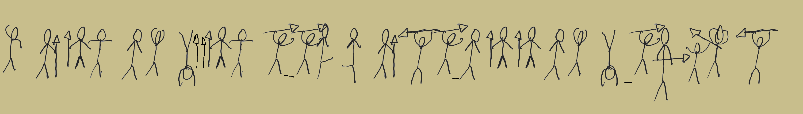

# Crypto - Tusken Painter
> Crypto - 250pts
"Who writes like a caveman on Tatooine?"

Obi-Wan Kenobi is wandering in the dessert of Tatooine when he suddenly discovers 
some wierd drawings on the entry of a cave. As the force tingles he thinks it reveals 
an important event to occur in the furture. He notices that some figures are more 
frequent than others, can you help him discover what the drawing says? 

>>Hint: Frequency analysis

