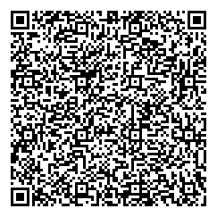

> # Qrcode
> > Rev-Eng - 300 pts
> 
> You and R2D2 are trying to get through a locked door but
> R2D2s systems are not designed to decode images.  
> See if you can help him!
> 
> 
> 

## Writeup

When you read the qrcode you might notice it is base64 encoded.  
When you decode the b64 you might notice the words ELF in the output.  
This indicates the output is an executable so you need to store the contents in a file, give it exec permissions and run it.

```
zbarimg -q qrcode.png --raw | base64 -d > flag
chmod +x flag
./flag
```

```
Flag: "UiTHack22{HelP_Me_ObI_WaN}"
```
